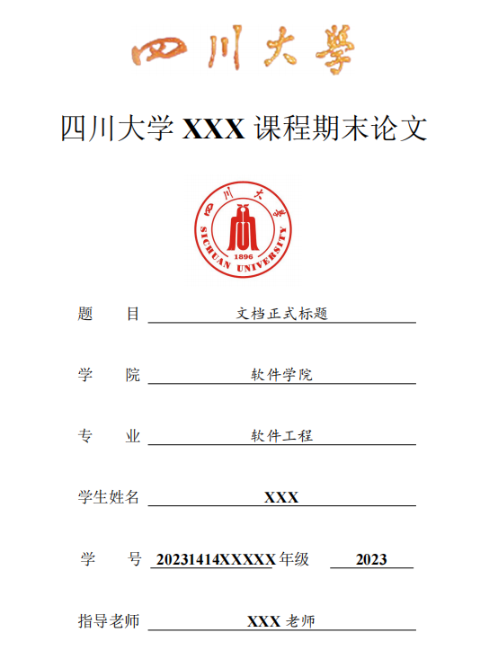

# SCU Thesis LaTeX Template

这是一个面向四川大学课程论文、课程设计说明或其他规范化文档场景的 LaTeX 模板仓库。在CC，Codex等工具的帮助下，能够帮助同学们快速写完一篇课程论文。

请注意本论文模板可能不适用于本硕博毕业论文模板要求，具体样式请参考当年的学校要求的论文模板，仅适用于课程论文任务。


## 仓库结构

- `main.tex`：主文件，通常只需要修改这一个文件
- `scuthesis.sty`：模板样式文件
- `ref/refs.bib`：参考文献数据库示例
- `images/`：封面和正文图片资源

## 模板示例

<p align="center">
  
</p>

## 快速开始

1. 克隆仓库

```bash
git clone https://github.com/Zhusx979/SCU-Thesis-LaTex-Template.git
cd scu_thesis_template
```

2. 打开 `main.tex`

- 按文件顶部注释修改标题、作者、学院、专业、学号、日期等基本信息
- 将示例摘要、正文、总结替换为你自己的内容
- 如需引用文献，编辑 `ref/refs.bib`
- 页眉的SCU Thesis Template可以在scuthesis.sty中ctrl+f搜索，修改即可。

3. 编译 PDF


Vscode中模板编译流程为：

```text
xelatex -> bibtex -> xelatex -> xelatex
```


## 致谢
本模板基于 [dahakawang/scu_thesis_template](https://github.com/dahakawang/scu_thesis_template) 修改而来。原模板需要编辑多个文件，本模板将其简化为仅需维护一个 main.tex 文件，显著降低了使用复杂度。在此向原作者致以诚挚的感谢。

欢迎通过提交 Issue 的方式，帮助我们共同改进和完善本模板。
